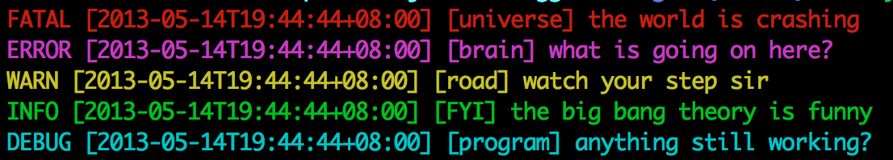

#Cologger
*Add some color to your logs!*

## Installation
This utils is packed as a gem, so, simply run `gem install cologger` to install it. 

Current version is 0.1.0

## Usage
Using cologger is quite easy && straight forward.

Start by creating a new logger

```
logger = Cologger.new
```

Next, set the log level you want. By default, cologger outputs all the logs to your console, which means setting the level to `LEVEL_DEBUG`. For more info about level, check out the `Log levels` section below.

```
logger.log_level = Cologger.LEVEL_DEBUG
```

After that, you can start logging. For example, 

```
logger.fatal "universe", "the world is crashing"
logger.error "brain", "what is going on here?"
logger.warn "road", "watch your step sir"
logger.info "FYI", "the big bang theory is funny"
logger.debug "program", "anything still working?"
```

And, here's what you got:



## Log
The first parameter of any log method, like the `universe` in the `fatal` log above, is taken as a tag, the other strings, concated by a space character, is treated as the log content.

## Log levels
Same as ruby `logger`, there are 5 levels. Namely, 

- FATAL, an unhandleable error that results in a program crash
- ERROR, a handleable error condition
- WARN, a warning
- INFO, generic (useful) information about system operation
- DEBUG, low-level information for developers

The levels are ordered desendingly according to thier level of importance.

## TODO
- Support file as output dev
- Customize log format
- Customize log level color


## Dependency

This gem depends on the cute [`colored' gem](https://github.com/defunkt/colored)  by [defunk](https://github.com/defunkt). 

Thanks sir!

## Change log
- 0.1.0, initial version. 