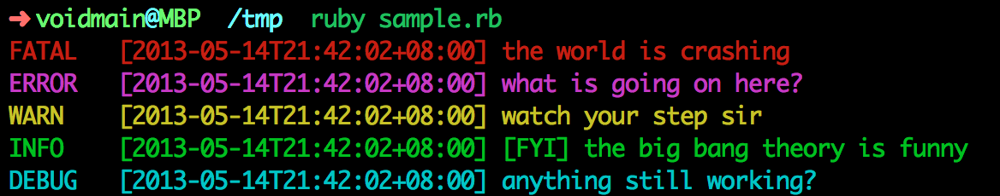

#Cologger
*Add some color to your logs!*

## Installation
This utils is packed as a gem, so, simply run `gem install cologger` to install it.

Current version is 0.1.3

## Usage
Using cologger is quite easy && straight forward.

Start by creating a new logger

```
logger = Cologger.new
```

Next, set the log level you want. By default, cologger outputs all the logs to your console, which means setting the level to `LEVEL_DEBUG`. For more info about level, check out the `Log levels` section below.

```
logger.log_level = Cologger.LEVEL_DEBUG
```

After that, you can start logging. For example,

```
logger.fatal "the world is crashing"
logger.error "what is going on here?"
logger.warn "watch your step sir"
logger.info "[FYI] the big bang theory is funny"
logger.debug "anything still working?"
```

And, here's what you got:



## Log
The first parameter of any log method, like the `universe` in the `fatal` log above, is taken as a tag, the other strings, concated by a space character, is treated as the log content.

## Log levels
Same as ruby `logger`, there are 5 levels. Namely,

- FATAL, an unhandleable error that results in a program crash
- ERROR, a handleable error condition
- WARN, a warning
- INFO, generic (useful) information about system operation
- DEBUG, low-level information for developers

The levels are ordered desendingly according to thier level of importance.

## Color schema
If you don't like our default color schema, which is `{ fatal: "red", error: "magenta", warn: "yellow", info: "green", debug: "cyan" }`, you can customize your own schema. 

To do so, you can add the following code before start logging:

```
new_color_hash = {
  fatal: "green",
  error: "NotAColor"
}
```

After that, apply this schema to your logger like this:

```
logger.update_colors new_color_hash
```

Now, if you do logging, here's what you'll get:


Notice that, when encountered an unknown color, the logger will complain about it in `red` color, and ignore this item. The same is true for the key, which is log level. 

### Possible colors
Since Cologger is built upon the cute `colored` gem, the colors we support is listed below:

- black 
- red  
- green 
- yellow
- blue  
- magenta
- cyan  
- white 

### Logging levels
In order to make your life easier, we choose to use simple word for the levels, the levels are listed below:

- fatal
- error
- warn
- info
- debug

## TODO
- Support file as output dev
- Customize log format


## Dependency

This gem depends on the cute [`colored' gem](https://github.com/defunkt/colored)  by [defunk](https://github.com/defunkt).

Thanks sir!

## Change log
- 0.1.3, you can use `update_colors` method to change the color schema
- 0.1.2, remove `tag` according to [@zhf](https://github.com/zhf)'s advice. User can add tag to content by themself when needed.
- 0.1.1, use `\t` to align timestamp.
- 0.1.0, initial version.
